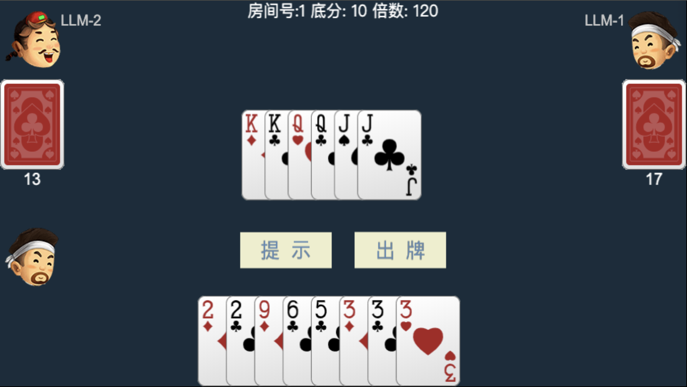

让 LLM（大语言模型）参与 斗地主 纸牌游戏。斗地主的规则、逻辑及界面都修改自 [doudizhu](https://github.com/mailgyc/doudizhu)，主要的修改是裁剪了 数据库、多用户的支持，去掉了客户端，直接在浏览器中访问。

## 安装

直接 clone 代码，到目录下运行相应的 python 程序进行启动。

```shell
git clone https://github.com/xu-xianghua/llm-ddz
cd llm-ddz
python run_ddz_txt_mode.py  # or start_ddz_server.py 
```

主要的依赖是 python(3.8+), Tornado 和 openai。或者用 pip install -r requirements.txt 安装依赖。

## 运行

支持两种运行方式：文本模式下的自动打牌 和 web 界面下的人机交互方式。

### 文本模式

该模式下人无法参与，只是让 LLM 之间或 LLM 与内置的简单机器人（Idiot）进行斗地主游戏，打牌过程和结果以文本方式显示。

启动命令示例：

```shell
cd llm-ddz
python run_ddz_txt_mode.py --p1-name=qwen --p2-model=deepseek-r1:32b --p3-idiot
```

通过命令行参数可以为每个（总共三个玩家，以 p1、p2、p3 表示）设置参数：

- --p1-name：玩家名字
- --p1-model: 使用的 LLM 模型名称，默认为 qwen2.5:32b
- --p1-base_url: LLM 提供的 API基础URL，默认为本地 http://localhost:11434/v1
- --p1-key: LLM 的 API密钥，默认为 ollama
- --p1-idiot: 不使用 LLM，使用内置的 Idiot 机器人
- --p1-system-prompt：为 LLM 设置的系统提示词，默认为空

### 人机交互模式

该模式要启动一个 web 服务器，然后在浏览器中访问 http://localhost:8080 ，可开始人与 LLM 的斗地主游戏。

后端基于Python+Tornado开发，只支持单机版，只能是人与两个 LLM 玩家对战。且目前两个 LLM 玩家只能是同一个 LLM，可通过启动命令行参数指定。

启动服务器命令示例：

```shell
cd llm-ddz
python start_ddz_server.py 
```

指定所用的 LLM 可通过命令行参数设置：

- --model: 使用的 LLM 模型名称，默认为 qwen2.5:32b
- --base_url: LLM 提供的 API基础URL，默认为本地 http://localhost:11434/v1
- --api-key: LLM 的 API密钥，默认为 ollama

运行界面截图：



